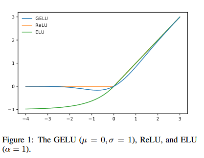

# GELUs : Relu 의 단점을 보완하여 현대(2020년대) 메인 모델들 bert, VIT에 activation function으로 사용됨
adaptive dropout의 수정판의 개념으로 만듬
Relu와 dropout을 합친 효과를 가짐
- dropout의 효과 : 1. ensemble 2. avoid catastrophic fogetten 3. generalize
- batch normalization이 dropout을 대신할 수 있어서 대체되는 중

2. GELU Formulation
둘 다 조건부에 따라 0, 1을 곱하는 방식이므로 합칠 수 있었다.
$$
GELU = x \times \Phi(x), \Phi(x)는 \,누적정규분포
$$

$$
GELU(x) = x * \frac{1}{2}(1 + erf(x/ \sqrt 2))
$$
$$
 0.5x(1+tanh(\root {2/\pi} (x+0.044715x^3)))
$$