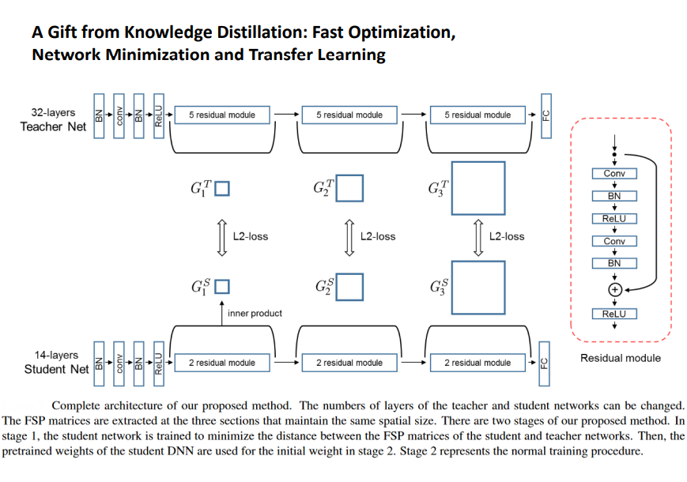

# 221129
# Knowledge Distillation

겁나 큰 모델을 가져와서 쓴대도 fine-tuning 등 실제 사용하기도 쉽지 않다.
https://keras.io/examples/keras_recipes/better_knowledge_distillation/  

transfer learning이 막상 잘 되지 않는다.
큰 모델, 복잡한 모델에서 특정부분을 작고 효율적인 모델이 수행할 수 있도록 하는 기법.(downstream)

- loss = 선생님의 softmax와 학생의 softmax의 차이를 줄인다.
분포의 차이를 구하는 기법( KL(선생님의 softmax, 학생의 softmax)) 쿨백-라이블러 발산(Kullback–Leibler divergence, KLD)은 두 확률분포의 차이를 계산하는 데에 사용하는 함수로, 어떤 이상적인 분포에 대해, 그 분포를 근사하는 다른 분포를 사용해 샘플링을 한다면 발생할 수 있는 정보 엔트로피 차이를 계산한다.
$ L_{Soft} = \sum_{x_iㅌX}{KL(softmax(\frac{f_T(x_i)}{\tau}, softmax(\frac{f_S(x_i)}{\tau})))} $
```
import tensorflow as tf

# 생성 모델 - variation autoencoder에 사용됨 - gan의 학습이 잘 안되는 단점이 장점인 모델
tf.keras.losses.KLD
```

Hard loss => 학생이 정답을 맞췄는지 여부

여러 loss의 합을 사용하는 경우   
$Student L_{Total} = L_{Task}+\lamda L_{Soft}$

1. What  
1.1 결과만 가져오는 response base  
1.2 feature map을 가져오는  
1.3 input-output 관계

- VA(variation autoencoder)
faster-RCNN에서 이미지도 가져와서 쓸 수 있다.
- transfer learning은 원본보다 성능이 2~5% 낮아지는데 (실험적 결과)
- distillation training은 원보보다 성능이 높아질 수 있다.

2. How

# distillation 의 종류
1. batch 방식 : 결과를 모아서 일정 기간마다 학습하는 방식(한달에 한번)
2. 새로운 데이터가 들어올때마다 학습하는 online distillation
3. self distillation : self supervised learning
- self supervisde learning과 강화학습의 차이는? : In fact, self-supervised learning is not unsupervised, as it uses far more feedback signals than standard supervised and reinforcement learning methods do. 

# Training Region-based Object Detectors with Online Hard Example Mining
- Hard traning : 가장 않 좋은 모델을 찾아서 그 모델 중심으로 다시 학습시켜 전체 성능을 올린다.
- online learning : 

Hard negative sampling : 원래 모델에서 학습시키고 못 맞춘 결과는 다시 원래 모델과 같이 생긴 모델에 따로 학습시킨다.

- sustainablity , scarablity: 지속가능성, 
## ensemble의 technique: begging, boosting(성능 안좋은 모델을 끌어올려가는 방법)

- detecting에서 자주 일어나는 문제들 : 크기가 바뀌면 못찾음, inbalance dataset(이미지의 대부분이 배경이고 분류할 대상이 아님)

### 자연어는 huggingface에 fine-tuning이든 distillation이든 만들어야한다.


