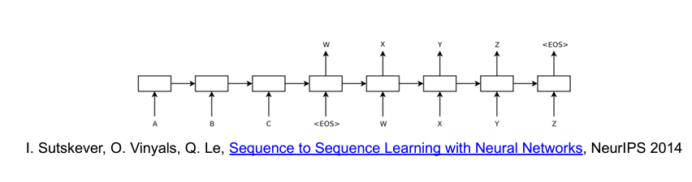
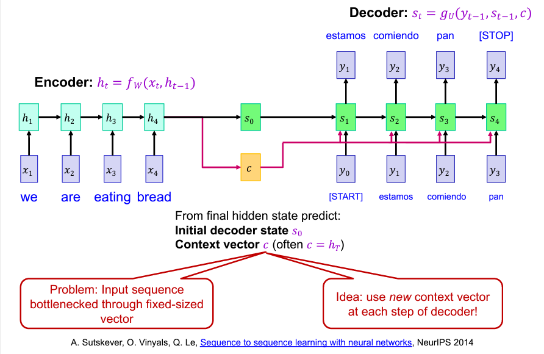
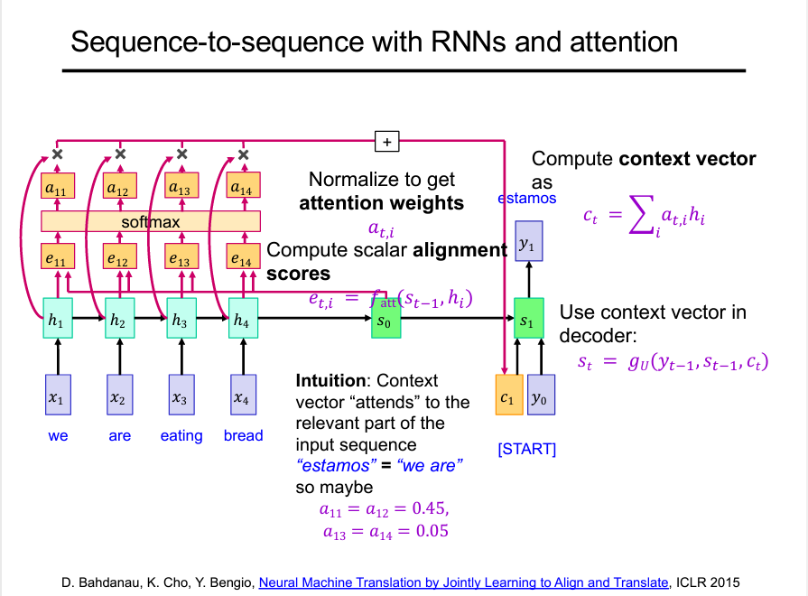

# 221207
# 고전 기계학습의 attention
사람이 직접 weight가 높은 layer를 weight를 더 높이는 식으로 조절했었다. 
학습을 통해 찾는 식으로 발전함

# seq2seq with RNNs
RNN many to many model을 모양을 정확히 봐야한다. 

RNN은 input output을 유연하게 설계할 수 있는데 인코딩 - 디코딩 사이의 FC layer가 고정된 사이즈여야 한다는 점이 문제
모델이 한 번 결정되면 input size와 output size가 다를 경우에 대처하지 못함.

input을 embedding해서 일정한 input size로 바꾸고 시작한다.

context vector가 모든 layer에서 고정되어 있었다.

언어 번역의 경우 : 
각 단어의 매칭과 어순(alignment)가 중요한 정보

# attention

input 들의 정보를 가지고 크기와 상관없는 context vector를 생성한다.
weight를 한 번 더 곱하는 개념
출력하는 길이와 상관없이 성능이 꾸준히 나옴.

# 영상에서의 attention
SENet : squeeze and Excitation network

# attention 구조의 문제점
encoding 된 정보를 필요로 한다.

- self-attention : input만의 관계를 구한다.