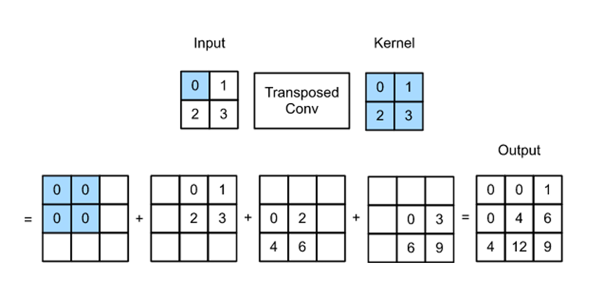
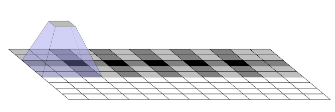
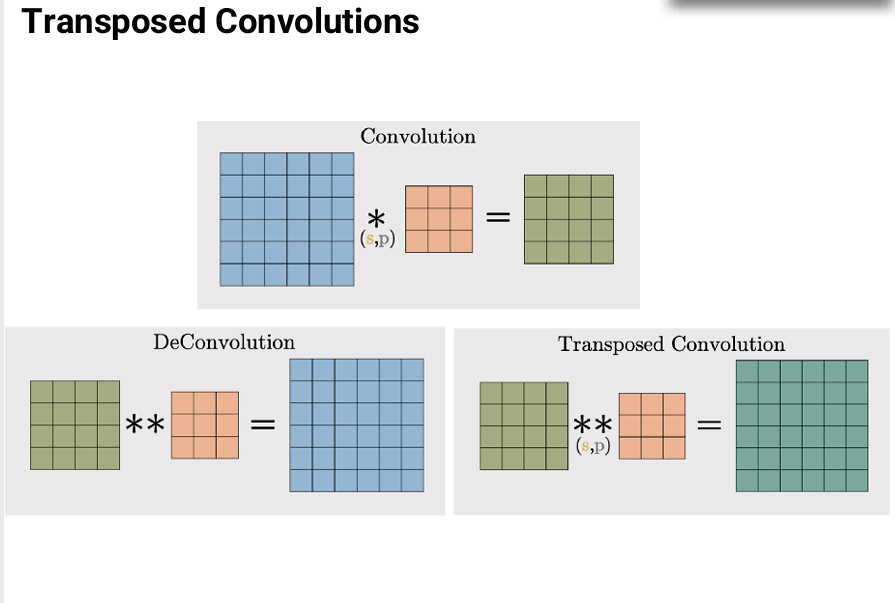

# Vertorized

# transpose Convolution : 전치행렬로 행렬곱

사이즈를 자유롭게 조절할 수 있다.
artifect 문제가 발생

https://distill.pub/2016/deconv-checkerboard/

## Deconvolution : feature map을 복원 시키는 연산 - 역연산 - 역행렬로 행렬곱

## upsampling : pooling처럼 자연수배로 늘려준다.
